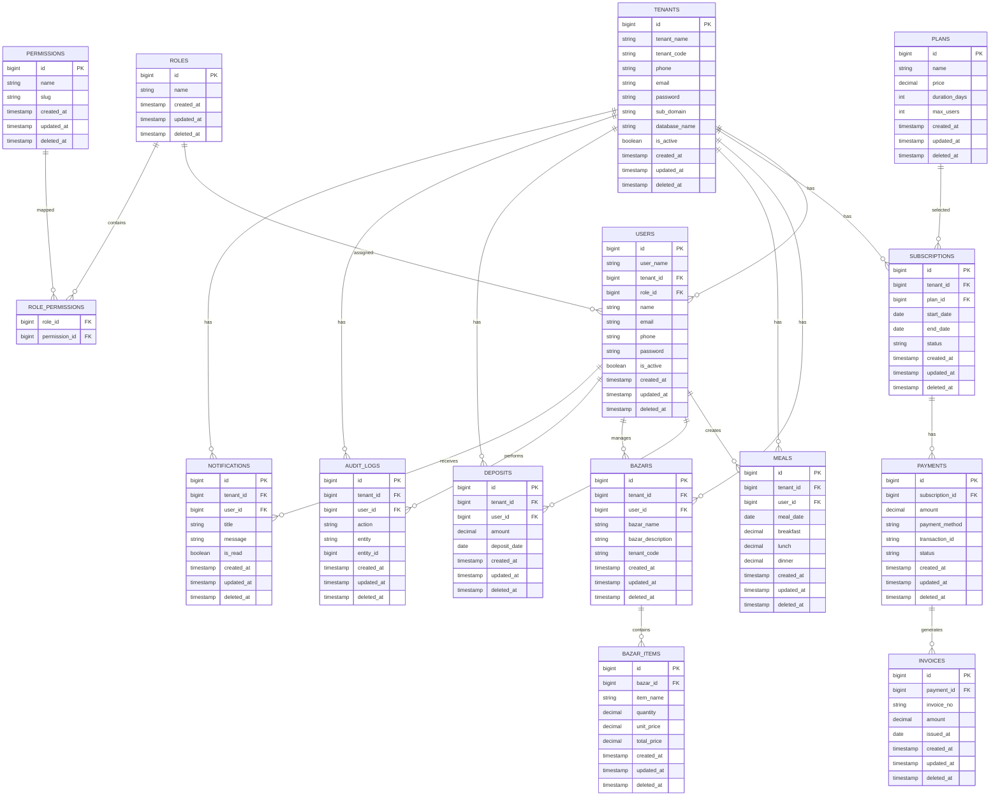

````markdown
# Massify

> A brief one-line description of what Massify does.

---

## Table of Contents

- Overview
- Features
- Tech Stack
- Project Structure
- Prerequisites
- Installation
- Configuration
- Running the Application
- API Documentation
- Database Migration
- Testing
- Docker
- Deployment
- Environment Variables
- Logging
- Project Architecture
- Database Design (ERD)
  - Detailed ERD Documentation
- Development Workflow
- Contributing
- License
- Contact

---

# Overview

Describe the purpose of the project.

Example:

Massify is a scalable backend service built with Go that provides REST APIs for managing users, authentication, and business operations.

---

# Features

- User Authentication
- JWT Authorization
- REST API
- PostgreSQL Integration
- Redis Caching
- Background Workers
- Docker Support
- Structured Logging
- Configuration Management

---

# Tech Stack

- Go
- Gin / Fiber / Echo
- PostgreSQL
- Redis
- Docker
- JWT
- Swagger
- Makefile

---

# Install package 

- go get github.com/labstack/echo/v5
- go get github.com/go-playground/validator/v10
- go get godotenv.com/joho/godotenv
-


```
---

# Project Structure

```text
mms/
├── cmd/
│   └── main.go                 # Application entry point
├── internal/
│   ├── auth/                   # Authentication logic
│   ├── config/                 # Configuration management
│   ├── database/               # Database setup and connections
│   ├── domain/                 # Domain-driven feature modules
│   │   ├── bazars/             # Bazar/Expense operations
│   │   ├── deposits/           # Deposit tracking
│   │   ├── meals/              # Meal count tracking
│   │   ├── messes/             # Mess (group) management
│   │   ├── tenant/             # Tenant-specific logic (handlers, repositories, services, DTOs)
│   │   └── users/              # User account and profile logic
│   ├── httpresponse/           # Standardized HTTP API responses
│   ├── middleware/             # HTTP server middlewares
│   ├── server/                 # HTTP server bootstrap/setup
│   └── utils/                  # Utility and helper functions
├── .env                        # Local environment variables
├── .gitignore                  # Git ignore file
├── Makefile                    # Task automation
├── go.mod                      # Go module dependencies
├── go.sum                      # Go module checksums
└── README.md                   # Project documentation
```

# Prerequisites

- Go 1.24+
- PostgreSQL
- Redis
- Docker (optional)

---

# Installation

```bash
git clone https://github.com/your-org/massify.git

cd massify

go mod download
```

---

# Configuration

Create an environment file.

```bash
cp .env.example .env
```

Update values.

---

# Environment Variables

| Variable | Description | Default |
|----------|-------------|----------|
| APP_NAME | Application name | Massify |
| APP_PORT | Server port | 8080 |
| DB_HOST | Database host | localhost |
| DB_PORT | Database port | 5432 |
| DB_USER | Database user | postgres |
| DB_PASSWORD | Database password | password |
| DB_NAME | Database name | massify |
| JWT_SECRET | JWT Secret | - |
| REDIS_HOST | Redis Host | localhost |

---

# Running the Application

Run locally

```bash
go run cmd/server/main.go
```

or

```bash
make run
```

---

# Database Migration

Run migrations

```bash
make migrate-up
```

Rollback

```bash
make migrate-down
```

---

# API Documentation

Swagger documentation

```
http://localhost:8080/swagger/index.html
```

Generate Swagger

```bash
swag init
```

---

# Testing

Run all tests

```bash
go test ./...
```

Run with coverage

```bash
go test ./... -cover
```

---

# Docker

Build image

```bash
docker build -t massify .
```

Run services

```bash
docker compose up
```

---

# Logging

Massify uses structured logging.

Example:

```text
INFO  Server started
ERROR Database connection failed
```

---

# Project Architecture

```text
Client
   │
   ▼
Router
   │
Middleware
   │
Handler
   │
Service
   │
Repository
   │
Database
```

---
# Database Design (ERD)



## Detailed ERD Documentation

This section describes how the multi-tenant architecture is structured, how user authorization/roles are managed, and how the operational database modules relate to one another.

### 1. Core Architecture: Multi-Tenancy
The database operates on a **multi-tenant shared-schema architecture**. This means data from all customer organizations (messes or hostels) is stored in the same database tables, but isolated logically.

* **`TENANTS` table**: This is the root entity. Every hostel or mess group that registers gets a unique record here.
  * `database_name`: Allows for optional database-per-tenant scaling if needed.
  * `sub_domain`: Defines the URL access point (e.g., `greenhouse.massify.com`).
  * `tenant_code`: A clean, unique identifier for reference numbers.
* **Tenant Isolation**: Almost every operational table (e.g., `USERS`, `SUBSCRIPTIONS`, `MEALS`, `DEPOSITS`, `BAZARS`, `AUDIT_LOGS`, `NOTIFICATIONS`) has a `tenant_id` foreign key. All queries executed by the application must filter by this ID (e.g., `WHERE tenant_id = ?`) to prevent data leakage between messes.

### 2. Access Control Layer: RBAC (Roles & Permissions)
Security is implemented using **Role-Based Access Control (RBAC)**. Rather than hardcoding authorization logic, users are assigned permissions dynamically.

* **`USERS` table**: Represents borders, cooks, or managers inside a tenant. They belong to a specific tenant (`tenant_id`) and have a single role (`role_id`).
* **`ROLES` table**: Stores user group classifications (e.g., `"Super Admin"`, `"Mess Manager"`, `"Border"`, `"Cook"`).
* **`PERMISSIONS` table**: Stores fine-grained application actions identified by a `slug` (e.g., `bazar:add`, `meal:edit`, `deposit:approve`).
* **`ROLE_PERMISSIONS` table**: A junction table that resolves the many-to-many relationship between `ROLES` and `PERMISSIONS`.
  * **How it works**: When a user logs in, the application preloads their role and permissions. Before performing an action (like entering a Bazar expense), the middleware checks if the permission slug exists in the user's role permissions collection.

### 3. Subscription & Billing Flow (SaaS Layer)
This segment is responsible for managing tenant licensing, payment processing, and billing history.

```text
 PLANS  ──[selected by]──►  SUBSCRIPTIONS  ──[has]──►  PAYMENTS  ──[generates]──►  INVOICES 
```

1. **`PLANS` table**: Defines pricing structures (e.g., `"Basic Plan"`, price, duration in days, and maximum users).
2. **`SUBSCRIPTIONS` table**: Tracks which plan a tenant is currently using, along with its activation window (`start_date` to `end_date`).
3. **`PAYMENTS` table**: Keeps records of payment transactions (e.g., via bKash, SSLCommerz, cards) tied to a specific subscription renewal.
4. **`INVOICES` table**: A downstream document generated immediately after a successful payment transaction for accounting and taxation records.

### 4. Operational Modules: Mess Transactions
These tables represent the day-to-day operations of the mess.

#### A. Meals Module (`MEALS` table)
Tracks daily food consumption for calculating individual user food expenses at the end of the month.
* A user can have many meal entries (typically one record per day).
* `breakfast`, `lunch`, and `dinner` are stored as decimals (e.g., `0.5`, `1.0`, `1.5`) because members may consume half-meals or guest-meals.

#### B. Deposits Module (`DEPOSITS` table)
Tracks the advance payments made by users to fund the mess's shopping.
* When a border deposits money (e.g., BDT 2000), a record is created here.
* The system sums these records to compute the user's current **credit balance**.

#### C. Bazar & Expenses Module (`BAZARS` & `BAZAR_ITEMS` tables)
Tracks the cost of purchasing food items from the local market.
* **`BAZARS`**: The parent record capturing who went shopping (`user_id`), when (`bazar_date`), and how much they spent (`total_amount`).
* **`BAZAR_ITEMS`**: The line-item details of the purchase (e.g., 5 kg Rice at BDT 80/kg = BDT 400). It links back to the main bazar trip via `bazar_id`.
* **Meal Rate Calculation Formula**: At the end of a billing cycle, the system calculates the monthly meal rate:
  $$\text{Meal Rate} = \frac{\sum(\text{Total Bazar Amounts})}{\sum(\text{All consumed meals})}$$

### 5. Auditability & Communication
* **`AUDIT_LOGS` table**: Crucial for security and compliance. It logs **who** did **what** to **which resource** (e.g., User 3 edited Meal Record 102). It links to the performer (`user_id`) and the tenant context (`tenant_id`).
* **`NOTIFICATIONS` table**: Stores system alerts (e.g., "Monthly bill generated", "Bazar limit exceeded") delivered to specific users.

---

# Development Workflow

1. Create a feature branch.

```bash
git checkout -b feature/new-feature
```

2. Commit changes.

```bash
git commit -m "Add new feature"
```

3. Push branch.

```bash
git push origin feature/new-feature
```

4. Open a Pull Request.

---

# Makefile Commands

| Command | Description |
|----------|-------------|
| make run | Run application |
| make test | Run tests |
| make build | Build binary |
| make lint | Run linter |
| make migrate-up | Apply migrations |
| make migrate-down | Rollback migrations |
| make docker | Build Docker image |

---

# Contributing

1. Fork the repository.
2. Create a feature branch.
3. Commit changes.
4. Push to your branch.
5. Open a Pull Request.

---

# License

This project is licensed under the MIT License.

---

# Contact

Maintainer: Your Name

Email: your@email.com

GitHub: https://github.com/your-username
````

This structure follows common conventions used in production Go backend projects, making it easy for new contributors to get started and for maintainers to document setup, architecture, and operational details.


---

Yes. For your **Messify (Mess/Hostel Management System)**, this stack is a very good choice and is used in many production backend applications.

### Recommended Tech Stack

| Technology | Purpose                                                         |
| ---------- | --------------------------------------------------------------- |
| Echo       | Build REST APIs and handle HTTP requests                        |
| GORM       | Interact with the database using Go structs                     |
| PostgreSQL | Store application data (users, expenses, meals, payments, etc.) |
| Redis      | Cache data, manage sessions, rate limiting, OTP storage         |

### Where each technology is used in Messify

#### Echo

* Authentication APIs
* Member management
* Meal management
* Expense management
* Payment APIs
* Dashboard APIs

#### GORM

* CRUD operations
* Relationships (`User`, `Tenant`, `Meal`, `Expense`)
* Transactions
* Pagination
* Soft delete

#### PostgreSQL

Store all permanent data:

* Tenants
* Members
* Roles
* Meals
* Meal rates
* Expenses
* Deposits
* Monthly reports
* Notifications

#### Redis

Use Redis for temporary or high-speed data:

* JWT token blacklist (logout)
* OTP verification
* Email verification codes
* API rate limiting
* Frequently accessed dashboard statistics
* Caching monthly meal rate calculations
* Background job queues

### Industry Architecture

```text
Client (Next.js)
        │
        ▼
     Echo API
        │
 ┌──────┴────────┐
 │               │
 ▼               ▼
GORM          Redis
 │               │
 ▼               │
PostgreSQL ◄─────┘
```

### As Messify grows, you can add

* Authentication: JWT
* Validation: go-playground/validator
* Migrations: golang-migrate
* Background jobs: Asynq (with Redis)
* File storage: S3-compatible storage (e.g., MinIO or AWS S3)
* Logging: Zap
* Monitoring: Prometheus + Grafana
* Containerization: Docker
* Reverse proxy: Nginx
* Deployment: Kubernetes (if needed at larger scale)

For your goal of building an **industry-standard SaaS application** like Messify, **Echo + GORM + PostgreSQL + Redis** is a solid, scalable foundation.
